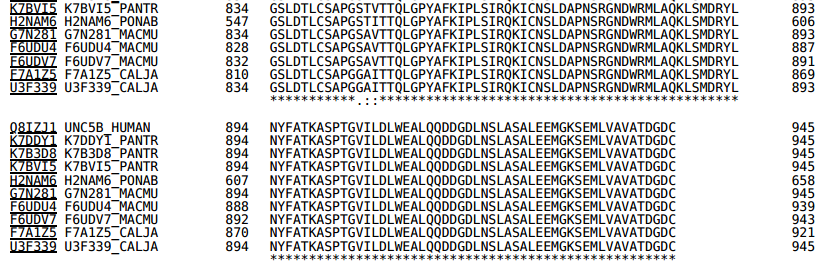

# 1. Primary and Secondary Structure Analysis
> Yuejian Mo,11510511


## Introduction
Protein's primary structure is sequence of aminod acid. We can find some conservation
of same protein which vary on different organs and different species. So it is
possbile to find out domain from these conservative sequence. Comparing amino
acid sequence and certain algorithm, we can print the phylogenetic tree.

The information of amino acid sequence is not enough to build up protein with
certain biological activity, but the secondary structure and higher
dimemnsion structure do. Based on the features of known experiment result between
primary structure and secondary structure, we can predict the helix, strand and
turn structure in unkown protein.


## Methods

In the first part, we selected 10 homology sequences of human UNC5b, including
both orthologues and paralogues from uniprot.org. There are

>UNC5B_HUMAN, K7DDTY1_PANTR,K7B3D8_PANTR,K7BVI5_PANTR,H2NAM6_PONAB,G7N281_MACMU,
>F6UDU4_MACMU,F6UDV7_MACMU,F7A1Z5_CALJA,U3F339_CALJA

Then we aligned and generated a phylogenetic tree sequence with the Clustal Omega
program in uniprot.org.

In the second part, we used JPred to predicte secondary structure of the
cytoplasmic domain of human UNC5b. Then we compared the predicted result with
X-ray structure(PDB:3G5B) to get error.

Last part, we design a truncation construct with minimal size, wheres retaining
the overall fold. We keep all the E and H domain sequence and binding site for
residue PO4A.

## Results
### Target Sequence and Aligment results




### Phylogenetic Tree
```

|------------------------------------------------------------------ F7A1Z5_CALIA
|      |----------------------------------------------------------- H2NAM6_PONAB
|------|               |------------------------------------------- U3F339_CALJA
       |---------------|             |----------------------------- UNC5B_HUMAN
                       |-------------|       |--------------------- K7BVI5_PANTR
                                     |-------|             |------- K7DDY1_PANTR
                                     |       |-------------|
                                     |                     |------- K7B3D8_PANTR
                                     |       |--------------------- F6UDU4_MACMU
                                     |-------|             |------- G7N281_MACMU
                                             |-------------|
                                                           |------- F6UDV7_MACMU
```

``` bash

Seq : YRRNCRDFDTDITDSSAALTGGFHPVNFKTARPSNPQLLHPSVPPDLTASAGIYRGPVYALQDSTDKIPMTNSPLLDPLP
Pre :-----------EE-------------------------------------------------------------------
Exp :
Err :           12

SLKVKVYSSSTTGSGPGLADGADLLGVLPPGTYPSDFARDTHFLHLRSASLGSQQLLGLPRDPGSSVSGTFGCLGGRLSI
----------------------------------------------------------------EEEEEEE----EEEEE
                                                                 EEEEEE    EEEEE
                                                                3

PGTGVSLLVPNGAIPQGKFYEMYLLINKAESTLPLSEGTQTVLSPSVTCGPTGLLLCRPVILTMPHCAEVSARDWIFQLK
E--EEEEEE---------EEEEEEEE--------------EEEEEEEEEE--------EEEEEEE---------EEEEEE
   EEEEEE          EEEEEEE             EEE    EEE          EEEEE           EEEEE
4                 5                    6  78910  11       12    13       14

TQAHQGHWEEVVTLDEETLNTPCYCQLEPRACHILLDQLGTYVFTGESYSRSAVKRLQLAVFAPALCTSLEYSLRVYCLE
E-------EEE-----------EEEEE---EEEEEE-----HHHHH--------EEEEEEEE----------EEEEEE--
EE     EEEEE          EEEEE   EEEEEE   EEEEEEEE      EEEEEEEEEEE      EEEEEEEEEE
15     16  17                         1819   20      21      2223     2425   2627

DTPVALKEVLELERTLGGYLVEEPKPLMFKDSYHNLRLSLHDLPHAHWRSKLLAKYQEIPFYHIWSGSQKALHCTFTLER
----HHHHHHHHHH----EEE----EEEEE-----EEEEEEE------E------EEEEE---HH--------EEEEEE-
  HHHHHHHHHHHHHH EEE    EEEEE      EEEEEE      EE       EEE HHHHH       EEEEEEEE
2829        3031 32 33  34   35                36      37  383940       41    42

HSLASTELTCKICVRQVEGEGQIFQLHTTLAETPAGSLDTLCSAPGSTVTTQLGPYAFKIPLSIRQKICNSLDAPNSRGN
--------EEEEEEE--------EEEE----------------------------------HHHHHHHHHH---------
      EEEEEEEEEE    EEEEEEEEE                     EEE        HHHHHHHHHHH
      43     4445   464748 4950                  515253                54

DWRMLAQKLSMDRYLNYFATKASPTGVILDLWEALQQDDGDLNSLASALEEMGKSEMLVAVATDGDC
HHHHHHHH------HHHHH----HHHHHHHHHHHH------HHHHHHHHHH---HHHHHHHHH----
 HHHHHHH       HHHH    HHHHHHHHHHHHH      HHHHHHHHH    HHHHHHH
55           56                   57     58          59       60

--------------------------------------------------------------------------------

```

Sequence total length: 339  Error ratio= (mismatch of predition compare eith
correct)/(total sequence length)=60/339=17%


### Minisize sequence:

The minisize sequence are marked as *

``` bash

Seq    : YRRNCRDFDTDITDSSAALTGGFHPVNFKTARPSNPQLLHPSVPPDLTASAGIYRGPVYALQDSTDKIPMTNSPLLDPLP
Known  :
Design :

SLKVKVYSSSTTGSGPGLADGADLLGVLPPGTYPSDFARDTHFLHLRSASLGSQQLLGLPRDPGSSVSGTFGCLGGRLSI
                                                                 EEEEEE    EEEEE
                                                                 ******    *****

PGTGVSLLVPNGAIPQGKFYEMYLLINKAESTLPLSEGTQTVLSPSVTCGPTGLLLCRPVILTMPHCAEVSARDWIFQLK
   EEEEEE          EEEEEEE             EEE    EEE          EEEEE           EEEEE
   ******          *******             ***    ***          *****           *****

TQAHQGHWEEVVTLDEETLNTPCYCQLEPRACHILLDQLGTYVFTGESYSRSAVKRLQLAVFAPALCTSLEYSLRVYCLE
EE     EEEEE          EEEEE   EEEEEE   EEEEEEEE      EEEEEEEEEEE      EEEEEEEEEE
**     *****          *****   ******   ********      ***********      **********

DTPVALKEVLELERTLGGYLVEEPKPLMFKDSYHNLRLSLHDLPHAHWRSKLLAKYQEIPFYHIWSGSQKALHCTFTLER
  HHHHHHHHHHHHHH EEE    EEEEE      EEEEEE      EE       EEE HHHHH       EEEEEEEE
  ************** ***    *****      ******      **       *** *****       ********

HSLASTELTCKICVRQVEGEGQIFQLHTTLAETPAGSLDTLCSAPGSTVTTQLGPYAFKIPLSIRQKICNSLDAPNSRGN
      EEEEEEEEEE    EEEEEEEEE                     EEE        HHHHHHHHHHH
      **********    *********                     ***        ***********
DWRMLAQKLSMDRYLNYFATKASPTGVILDLWEALQQDDGDLNSLASALEEMGKSEMLVAVATDGDC
 HHHHHHH       HHHH    HHHHHHHHHHHHH      HHHHHHHHH    HHHHHHH
 *******       ****    *************      *********    *******

```


## Conclusions
Here are conservation of protein in different organs and speices, which
suggested the evolution of protein. Using cetain technique, secondary structure
can be predicted in acceptable range. But we think that the different of our
choose target is small and not enough to show the essential domain. And we
risks to keep beta strand and alpha helix.
