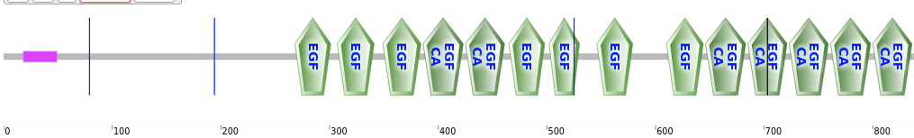
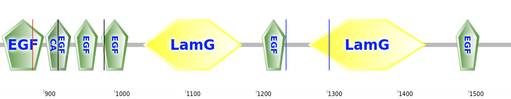
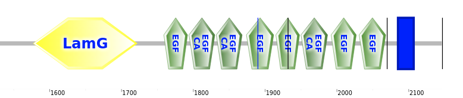
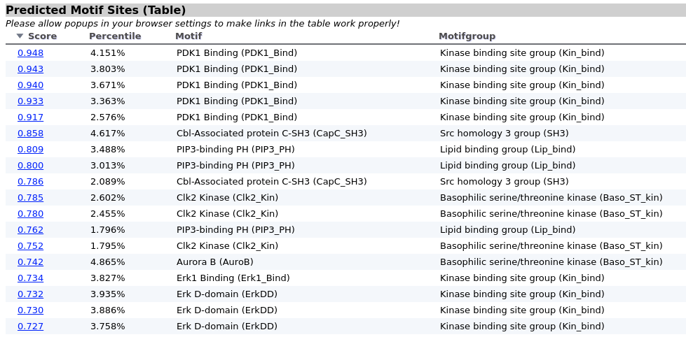
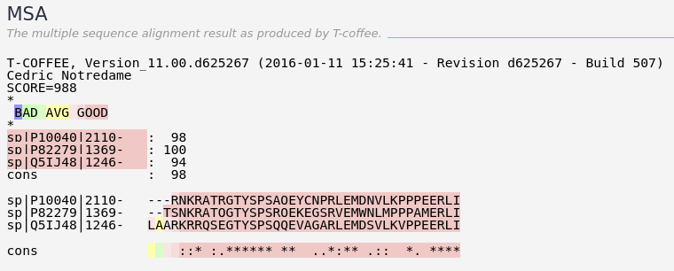
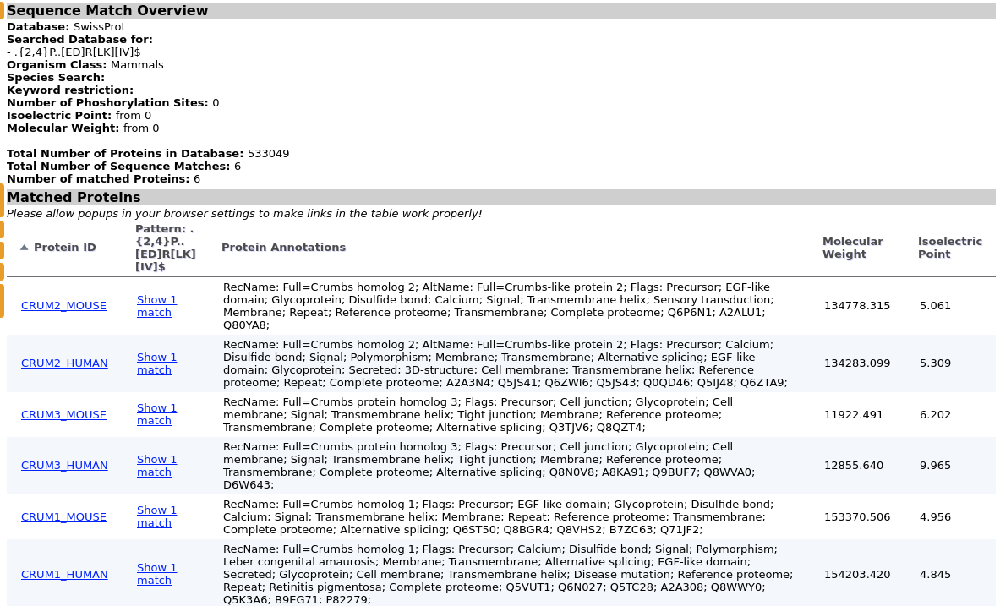

# Protein Profiling
> Yuejian Mo,11510511

## Introduction
Based on the motif which we has known to predict the motif of new protein.

## Methods
1. From uniprot.org find the sequense of *Drosophila* Crubm UniProtKB-P10040(CRB_DROME).
 Then use SMART
(http://smart.embl-heidelberg.de/) to predict domain organization of
*Drosophila* Crumbs.
2. Use the Scansite(http://scansites.mit.edu/) to predict functional motifs in
Crumbs with sequence of CRB_DROME.
3. Using T-Coffeto align cytoplasmic domains from human Crb1 and Crb2 with
*Drosophila* Crumbs.
4. Based on the sequense profile, and use features "Find Sequence Match" on Scansite3
to find the protein which has similar motif in C-teriminal end.
5. Based on character of amino acid, justify whether this protein can bind with
the same PDZ domain.

## Results
1. Here are the domain organization predicted by SMART.

2. Here are some predicted motif sites with high score.

3. Alignment result of 3 sequences.

4.
Use the profile - .{2,4}P..[ED]R[LK][IV]$ and find following

5.
CRUM2_MOUSE,CRUM3_MOUSE,CRUM1_MOUSE.

## Conclusions
We can find out the motifs of new protein based on the feature of aminod acid.
