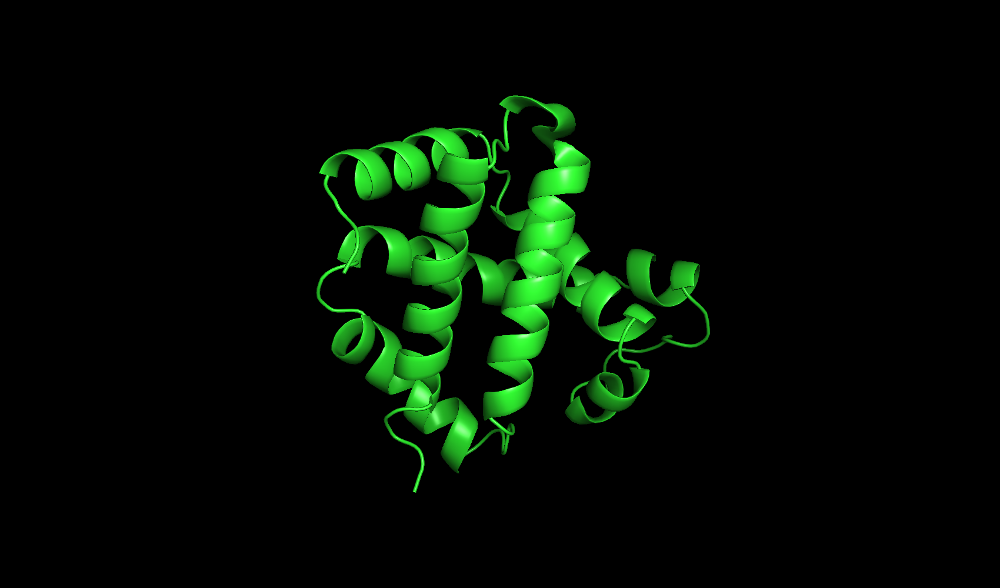
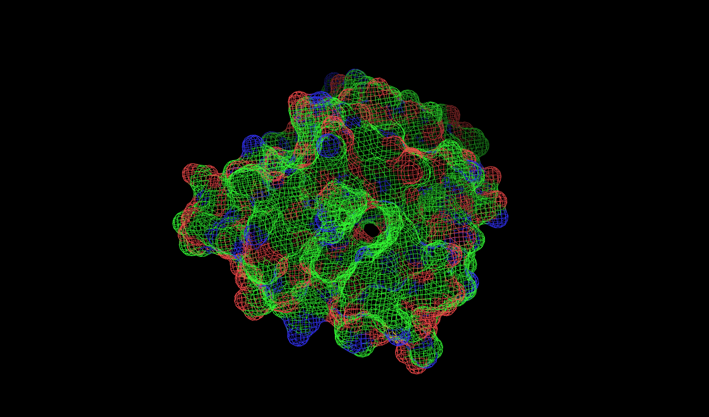
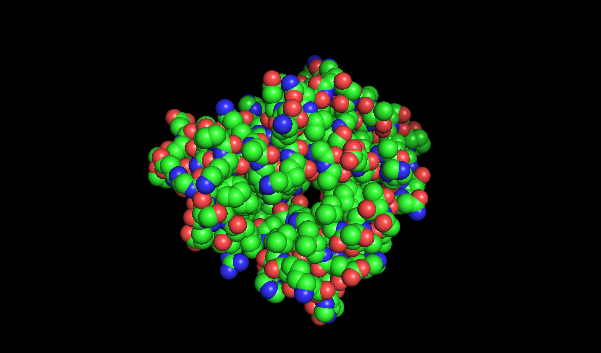

# Exp 4. Protein Data Bases, Finding and Viewing

## Introduction
Here are lots of protein structures information in data base. 

## Methods
1. Find the PDB ID of human hemoglobin, whose resolution is higher than 2 A.
2. Download the PDB coordinate file and check the detailed information in 
the file. Find out:
- How many protein chains? Which compounds in structures?
- Which compounds in structures?
- Which residues are missed in the coordinate?
3. Edit the coordinate file to make a new coordinate file that contain only 
one beta subunti of hemoglobin(beta-globin). Delet the atom postion of chain A,C,D, and HETAT HOH and HEM
4. Using PyMol to visualize the beta-globin structures in different viewing. Then save the result as pictures.

## Results
1. The Human Hemoglobin PDB ID is 1A3N. 1A3N's resolution is 1.80 ANGSTROMS, 
has 574 residues, related in 4/29/1998.
2. 1A3N has 4 chains, 2 alpha chains and 2 beta chains. Each chain contains
one HEM cofactor  HEM PROTOPORPHYRIN IX CONTAINING FE. and 450 Water molecure. 
And the first amino acid VAL in chain D is missed. 
3. The file name is 1A3N_beta.pdb
4.  

## Conclusion
PyMOL is a big and interactive draft paper for studying structure biology.