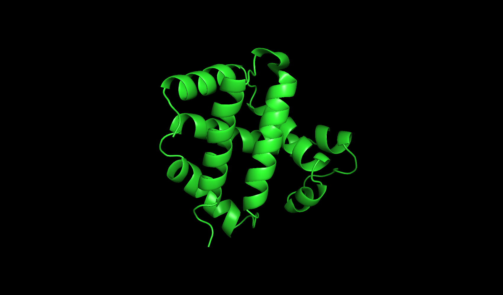
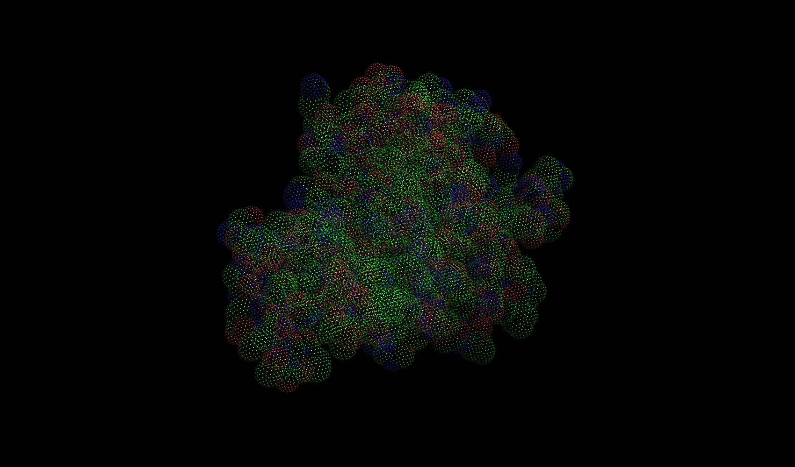
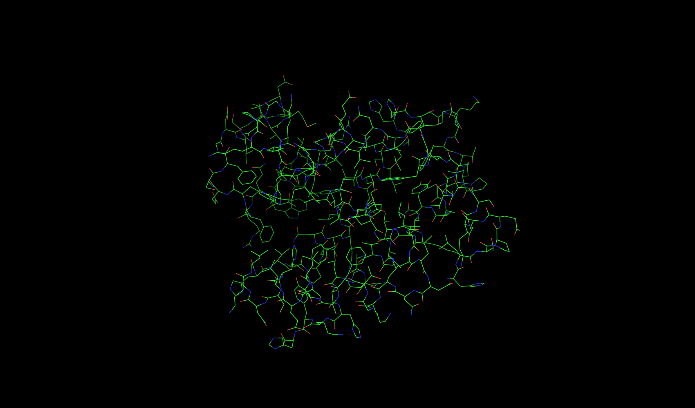
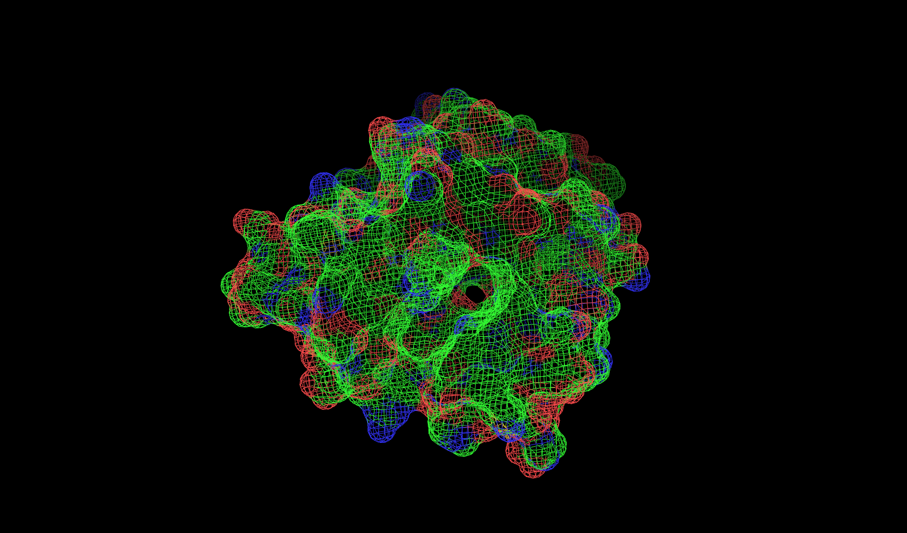
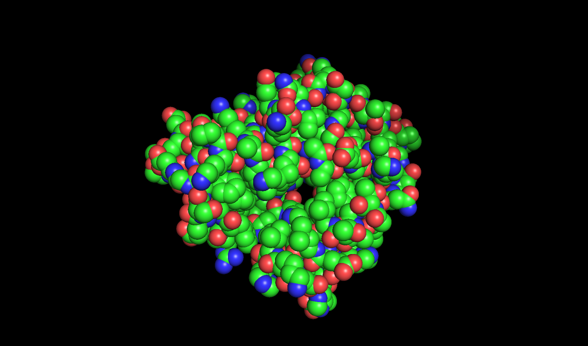
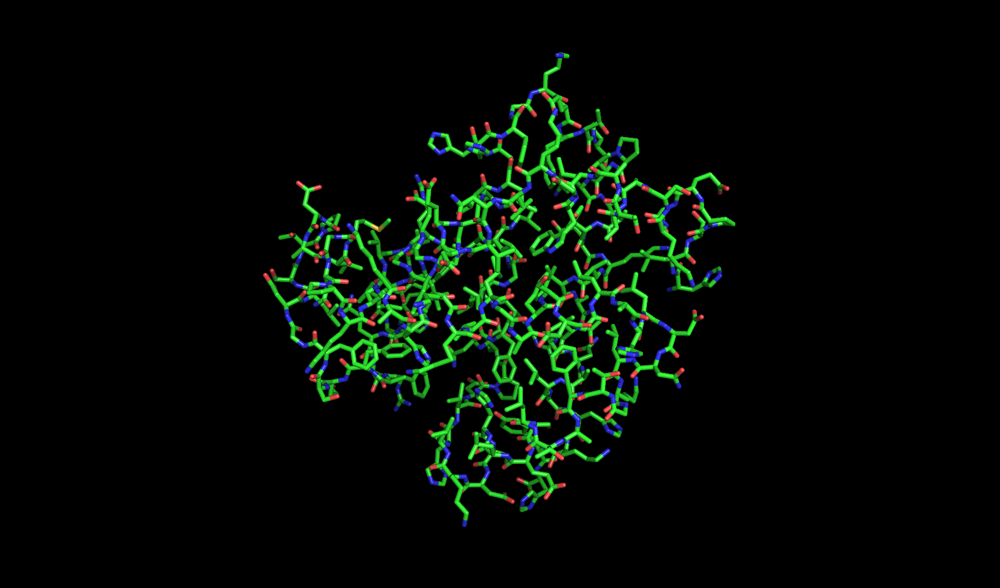
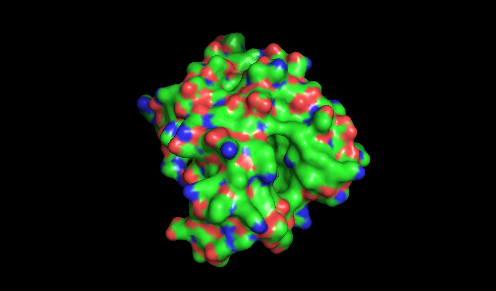

# Exp 4. Protein Data Bases, Finding and Viewing

> Yuejian Mo, 11510511, 2018/04/01

## Introduction
To understand protein's biological function, lots of scientists try to find 
out the physical structure of proteins. Here are some databases, which 
collect known protein's structure. So we can get these protein strcture from
database conveniently. Here are pdb.org and www.rcsb.org.

Typically, each protein from database contains a PDB text file. PDB file 
contain recongition information and atoms space positions. PDB file can be
visualized and edit by PyMol, which is a open source python package used
widely.

We will find and view human hemoglobin structure from database.

## Methods

1. Find the PDB ID of human hemoglobin from rcdb.org, whose resolution is 
higher than 2 A.
2. Download PDB coordinate file and check the detailed information in 
this file. Find out:
- How many protein chains?
- Which compounds in structures?
- Which residues are missed in the coordinate?
3. Delete the atom positions of chain A, C, D, HOH and HEM. We can get a 
new coordinate file contained only one beta subunit of hemoglobin
(beta-globin).
4. Using PyMol to visualize the beta-globin structures in different viewing.
Then save the result as pictures.

## Results

1. The Human Hemoglobin PDB ID is 1A3N. 1A3N's resolution is 1.80 angstroms,
has 574 residues, related in 4/29/1998.
2. 1A3N has 4 chains, 2 alpha chains and 2 beta chains. Each chain contains
one cofactor, called HEM PROTOPORPHYRIN IX CONTAINING FE . 450 water 
molecules is around hemoglobin. The first amino acid VAL in chain D is 
missed. 
3. The file name is 1A3N_beta.pdb
4. Visual pictures

## Conclusion
PyMOL is a big and interactive draft paper for studying structure biology.
