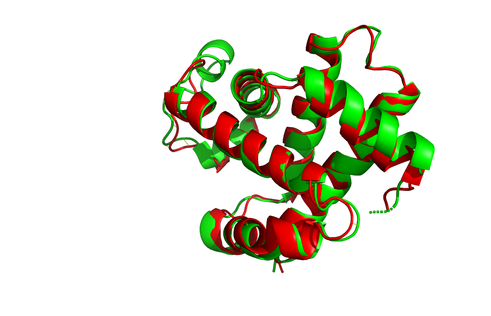
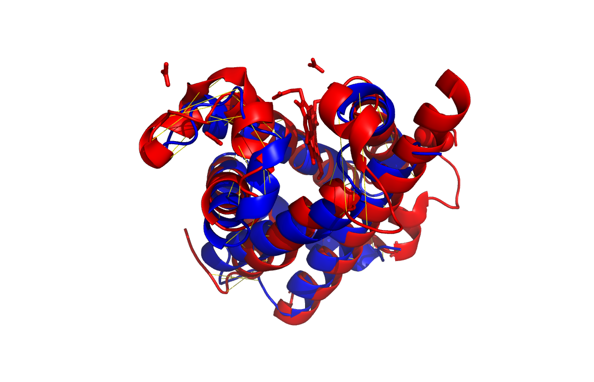
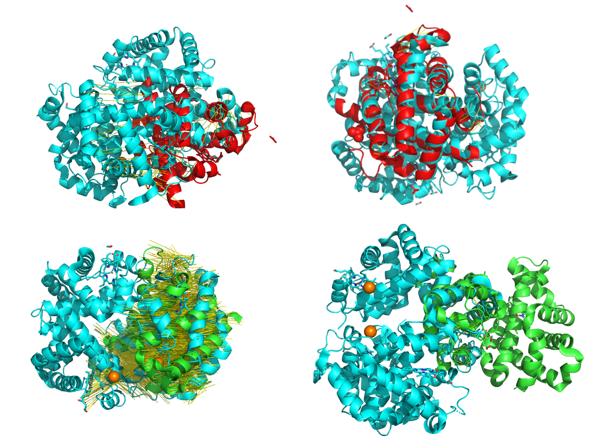

# Exp.5 Structure Comparision
>Yuejian Mo, 11510511


## Introduction
The CE algorithm is a fast and accurate protein structure alignment algorithm, 
pioneered by Drs. Shindyalov and Bourne. We will compare strcuture alignment and
sequence alignment.


## Methods
1. Get human hemoglobin structure (PDB id:4HHB) in PyMOL
``` bash
	fetch 4HHB
```
2. Create new objects containing either alpha-subunit or beta-subunint.
3. Align beta-subunit to alpha-subunit, record the RMSD value and
indication.
``` bash
	align alpha, beta,object=al_alpha_beta
	save aln_alpha_to_beta.aln
```
4. Analyze the pairwise sequence alignment.
5. Get human neuroglobin (PDB id: 4MPM) and a globin-like protein 
(PDB id: 4BJA), and align them to alpha-globin.
6. Use Cealign to ralign the globin-like protein to alpha-globin.
``` bash
	cealign alpha, 4bja,object=cealn_alpha_4bja
	save cealn_alpha_to_4bja.aln
```
7. Compare the structure-based alignment and simple sequence alignment
of the three globins
``` bash
	align  4hhb,4mpm, object=al_4mpm_4hhb
```


## Results
1. Save as _4HHB.PDB_
2. Save as _alpha.PDB_ and _beta.PDB_
3. Align beta-subunit to alpha-subunit
Score is 293.5, 907 atoms are alignment, RMSD=1.158 angstroms. Here are alignment
result.
``` bash
beta         VHLTPEEKSAVTALWGKV--NVDEVGGEALGRLLVVYPWTQRFFESFGDLSTPDAVMGNPKVK
alpha        VLSPAD-KTNVKAAWGKVGAHAGEYGAEALERMFLSFPTTKTYFPHFDLSH------GSAQVK
                    *..*.*.****  ...*.*.***.*.....*.*...*..*          *...**

beta         AHGKKVLGAFSDGLAHLDNLKGTFATLSELHCDKLHVDPENFRLLGNVLVCVLAHHFGKEFTP
alpha        GHGKKVADALTNAVAHVDDMPNALSALSDLHAHKLRVDPVNFKLLSHCLLVTLAAHLPAEFTP
             .*****..*.....**.*....... **.**..**.***.**.**...*...**.*..  ***

beta         PVQAAYQKVVAGVANALAHKYH                                         
alpha        AVHASLDKFLASVSTVLTSKYR                                         
             .*.*...*..*.*...*..**                                          
```


4. Analyze the pairwise sequence alignment
Most region which cannot be aligned are in loop region, which confirm that protein
function varies on loop.

5. Align 4MPM and 4BJA to alpha-globin

|  | Score | Aligned Atoms | RMSD(angstroms)|
|--|-----|---|---|
|alpha-->4bja | 34 |38 | Error -- no atoms left after refinement |
|alpha-->4mpm | 80.5 |121 |  1.916 |
 4BJA only has 38 atoms aligned with alpha-subunit, so the sequence align is
unreasonable.

``` bash
4mpm         MERPEPEL-IRQSWRAVSRSPLEHGTVLFARLFALEPDLLPLFQYNCRQFSSPEDCLS--SPE
alpha        VLSPADKTNVKAAWGKVGAHAGEYGAEALERMFLSFPTTKTYFPHF---------DLSHGSAQ
                      ....*..*.....*.*.....*.*...*... .*            .*   *..

4mpm         FLDHIRKVMLVIDAAVTNVEDLSSLEEYLASLGRKHRAVGVKLSSFSTVGESLLYMLEKCLGP
alpha        VKGHGKKVADALTNAVAHVDDMPNALSALSDL-HAHK-LRVDPVNFKLLSHCLLVTLAAHLPA
             ...*..**......**..*.*.... ..*..* .    . *....*......**..*...*. 

4mpm         AFTPATRAAWSQLYGAVVQAMSRGWDGEMERPEPELIRQSWRAVSRSPLEHGTVLFARLFALE
alpha        EFTPAVHASLDKFLASVSTVLTSKYR-------------------------------------
             .****..*........*                                              

4mpm         PDLLPLFQYNCRQFSSPEDCLSSPEFLDHIRKVMLVIDAAVTNVEDLSSLEEYLASLGRKHRA
alpha        ---------------------------------------------------------------
                                                                            

4mpm         VGVKLSSFSTVGESLLYMLEKCLGPAFTPATRAAWSQLYGAVVQAMSRGWDGE          
alpha        -----------------------------------------------------          
```                                                                            

6.Use cealign to align 4BJA to alpha-globin
Score is 80.500, 121 atoms aligned, RMSD is 3.9 Angstroms. Cealign is much 
better than simple sequence align.

``` bash
4bja         MGATLSAPKKKKTQVGASWVGNESENPFDLALNKKDRTLLRETWQR-LDDPKDIVGLIFLDIV
alpha        ------------------------------VLSPADKTNVKAAWGKVGAHAGEYGAEALERMF
                                           .*...*.*.....*.. ................

4bja         NDIEPDLKKVFGVDRAPRAAMLKMPKFGGHILRFYEFMEQLTSMLGTSENLTGAWQLVRKTGR
alpha        -LSFPTTKT--YFPHFDLS--HGSAQVKGHGKKVADALTNAVAHV------DDMPNALSALSD
              ...*..*.  ........  .......**...............      ............

4bja         SHVRQGFLEQNQNQMEKNYFEIV----INVFIERLIPFLTGEQELPSSEGKENKKVRFAQNYT
alpha        LHAH-----------KLRVDPVNFKLLSHCLLVTLAAHLPAEF--------------------
             .*..           ........    .......*...*..*.                    

4bja         TSQITDVWKKFLNTVISQMTDSFELERAKQKSAQTTKALAPHQHIEISERKKKRVAEKQSEIE
alpha        TPAVHASLDKFLASVSTVLTSKYR---------------------------------------
             *........***..*....*....                                       

4bja         NTAVSNEPKAQEQMFEDPF                                            
alpha        -------------------                                            
```



7. Compare the structure-based alignment and simple sequence alignment of the
three globin.
Save sequence alignment file as _aln_4bja_to_4hhb.aln_ and _al_4mpm_4hhb.aln_.
Save cealignment file as _ceal_4bja_4hhb.aln_ and _cealan_4mpm_4hhb.aln_.

|Protein              |Aligned       | RMSD |
|---------------------|--------------|------|
|4mpm->4hhb(sequence) | 1743 atoms   | 20.651 |
|4mpm->4hhb(cealign)  | 136 residues | 2.663 |
|4bja->4hhb(sequence) | 187 atoms    | 18.452  |
|4bja->4hhb(cealign)  | 136 residues | 3.919 |

In general, cealignment has lower RMSD than sequence alignment. Sequence
alignement exits more gap and short match sequence fragment. Althoug sequence
alignment presents more accurate amino acid math, cealignment alignment result 
seem more reasonable in biology function(Figure 3). 

| Sequence align        | Cealign align         |
|-----------------------|-----------------------|
|  | |


## Conclusions
Structure alignment is more robust than sequence aligment. Speically, alignement
sequence has low identity.


