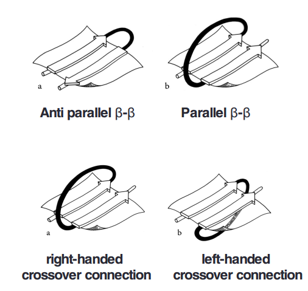

# TERTIARY STRUCTURE, DOMAIN, AND MOTIF

## Protein motif
Protein motif  is a kind of super secondary structure. Both
EF-hand and Grek key are protein motif.

## Domain: compact regionof protein structure
Domains are built form strutural motifs.Hydrophobic core
enhance the domain stability.

alpha domain
beta domain
alpha/beta domain
